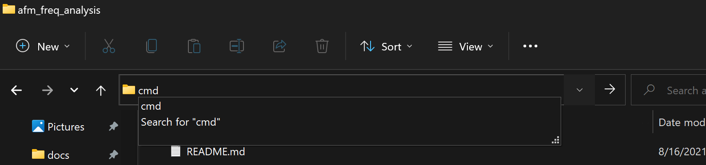

## Zach's data processing pipeline

### Project structure

#### Directories:
* `/data`: directory housing input data in TXT formats with the name `N_{Coating}_{Number}.txt`
* `/output`: directory where the main script will save the generated spreadsheets of procesed data

#### Files:
* `/main.py` the main python file. can be run with `python3 main.py` while in the project's root directory
* `/requirements.txt` the file describing the necessary packages for the python script to run
* `/spring_constantx.xlsx` excel sheet with spring constants for different data sets and subsets

### Running the program
* Make sure python3 is installed. Try running `python3` on the command line. It will either launch python or ask you to install it (Windows)
* Open a command prompt inside this directory. You can do this by typing `cmd` and hitting Enter in the location address bar in windows explorer

* create a virtual environment by executing the command below. This will create a new directory named `venv` in the folder
```
python -m venv venv
```
* activate the virtual environment and install the prerequisites by running the command illustrated below

* Run `python main.py` to run the script
* 
